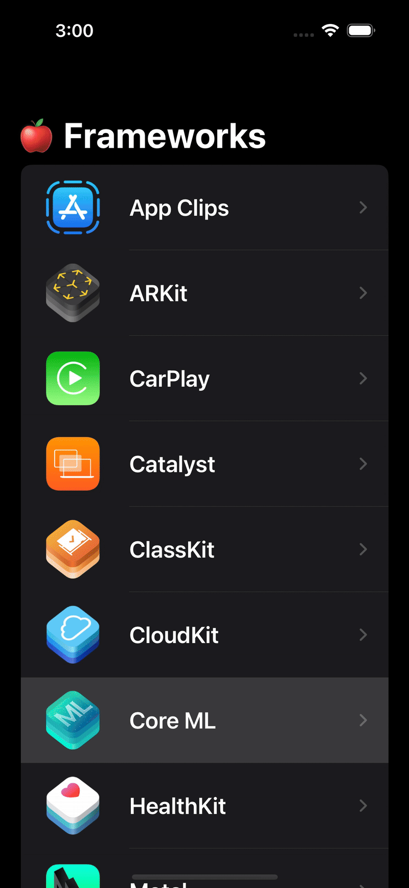

# 🍎 Apple Frameworks App

A **SwiftUI-based educational app** that displays a list of Apple frameworks.  
Users can tap on a framework to view its description and open official documentation using **SafariView** inside the app.

##  App Preview

<p align="center">
  
</p>

##  Features

-  Built entirely with **SwiftUI**
-  Integrated **NavigationLink** for seamless navigation
-  Open Apple Developer pages using **SafariServices**
-  Uses **MVVM pattern** with `FrameworkGridViewModel`
-  Custom color accents & system-friendly design

---

##  Components Overview

### `FrameworkGridView`
Displays a scrollable list of all frameworks fetched from mock data.  
Each item navigates to a detailed view on tap.

```swift
NavigationLink(
    destination: FrameworkDetailView(
        framework: framework,
        isShowingDetailView: $viewModel.isShowingDetailView
    )
) {
    FrameworkTitleView(framework: framework)
}
